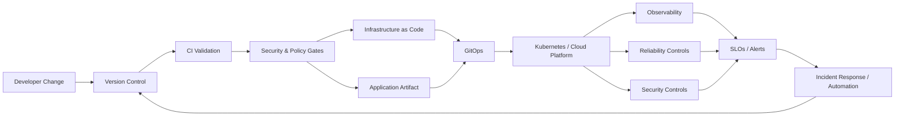

# Obinna Obika

### DevOps Engineer · Site Reliability Engineer · Platform Engineer · Cloud & Infrastructure Engineer

I build and automate cloud platforms with a focus on **reliability, security, observability, repeatability, and developer experience**. My engineering work spans Infrastructure as Code, Kubernetes, CI/CD, GitOps, cloud operations, platform automation, and SRE practices.

## Core Engineering Stack

| Domain | Technologies & Practices |
|---|---|
| **Cloud** | AWS · Microsoft Azure · Google Cloud Platform |
| **Infrastructure** | Terraform · Kubernetes · Docker · Helm · Linux |
| **CI/CD & GitOps** | GitHub Actions · Jenkins · Argo CD · GitOps |
| **Automation** | Python · Bash · Infrastructure Automation |
| **Observability** | Prometheus · Grafana · OpenTelemetry · CloudWatch |
| **Reliability** | SLOs · Error Budgets · Incident Response · DR · Automated Remediation |
| **Security** | IAM · RBAC · Policy as Code · DevSecOps · Supply Chain Security |
| **Platform Engineering** | Internal Developer Platforms · Golden Paths · Self-Service Infrastructure |

## Featured Engineering Projects

### ☁️ [Cloud Platform Engineering](https://github.com/obinna-obika-devops/cloud-platform-engineering)
**AWS · EKS · Terraform · Kubernetes · Helm · Argo CD · Prometheus · Grafana**

Internal developer platform architecture that turns cloud and Kubernetes primitives into a controlled self-service path. Includes Infrastructure as Code, GitOps delivery, workload isolation, observability, policy controls, SLOs, incident response, and disaster-recovery patterns.

### 🔄 [Infrastructure GitOps Engineering](https://github.com/obinna-obika-devops/infrastructure-gitops-engineering)
**Terraform · GitOps · Kubernetes · Argo CD · OPA · Python**

Infrastructure change-management system built around Git as the source of truth, environment promotion, policy gates, continuous reconciliation, drift detection, auditability, and rollback planning.

### 🧰 [Platform Engineering Portal](https://github.com/obinna-obika-devops/platform-engineering-portal)
**Python · FastAPI · Terraform · GitOps · Service Catalogs · Golden Paths**

Self-service platform control plane that translates developer requests into validated infrastructure plans while preserving governance, policy, and approval boundaries.

### 📈 [SRE Reliability Engineering Lab](https://github.com/obinna-obika-devops/sre-reliability-engineering-lab)
**SRE · Kubernetes · Prometheus · Grafana · OpenTelemetry · Python**

Reliability engineering environment covering SLIs/SLOs, error budgets, telemetry, Kubernetes reliability controls, controlled failure injection, incident response, and safe remediation automation.

### 🔐 [DevSecOps Supply Chain Security](https://github.com/obinna-obika-devops/devsecops-supply-chain-security)
**GitHub Actions · Trivy · Checkov · Gitleaks · Cosign · Kyverno · OPA**

Defense-in-depth software delivery controls spanning source, dependencies, infrastructure, containers, artifacts, and Kubernetes. Includes SBOM/provenance patterns, keyless signing, policy-as-code, and admission controls.

### 💰 [Cloud FinOps Cost Optimization](https://github.com/obinna-obika-devops/cloud-finops-cost-optimization)
**AWS · Terraform · Python · FinOps · Cost Analytics · Policy Automation**

Cloud cost engineering patterns for allocation, budgets, forecasting, anomaly detection, rightsizing, and governance using synthetic billing data and infrastructure examples.

## How I Approach Platform Reliability

The operating model is consistent across the projects: **version changes, validate early, automate delivery, enforce least privilege, measure reliability, expose meaningful telemetry, reduce blast radius, and make recovery repeatable.**

## Engineering Principles

- **Automate repeatable work** rather than relying on manual operational steps.
- **Treat infrastructure as software** with version control, validation, review, and reproducible delivery.
- **Design for failure** using health checks, SLOs, observability, recovery procedures, and controlled failure testing.
- **Build security into delivery** through identity, policy, scanning, artifact integrity, and deployment controls.
- **Create paved roads for developers** that improve velocity without bypassing operational or governance boundaries.
- **Keep changes observable and reversible** so teams can detect problems quickly and recover safely.

## Education & Technical Foundation

### Universal Technical Institute (UTI) — Miramar, Florida
**Automotive & Diesel Technology II · Graduated March 2025 · High Honors · GPA 3.74**

Completed an intensive hands-on technical program spanning electrical systems, advanced electrical applications, hydraulics, braking systems, steering and suspension, drivetrain and transmissions, diesel engines, transport refrigeration, hybrid technology, performance diagnostics, and preventive maintenance.

**Academic Recognition**
- Student of the Course — **Advanced Electrical Applications**
- Student of the Course — **Advanced Tech/Hybrid & Service Advising**
- **High Honors** graduate
- **Director’s List** recognition

This hands-on engineering background reinforces the same approach I bring to cloud and platform systems: structured troubleshooting, understanding dependencies, preventive maintenance, root-cause thinking, safe change, and reliability-focused operations.

### Additional Technical Certification
**MACS Section 609 Certification** — Mobile Air Climate Systems Association, April 2025  
Training in CFC-12, HFC-134a and HFO-1234yf refrigerant recycling and service procedures under Section 609 of the Clean Air Act.

> Credential documents containing personal information are intentionally not published in this public repository. Verification can be provided when appropriate.

## Additional Engineering Work

[Multi-Cloud Platform Engineering](https://github.com/obinna-obika-devops/multi-cloud-platform-engineering) · [Cloud Automation Engineering](https://github.com/obinna-obika-devops/cloud-automation-engineering) · [Cloud Networking Engineering](https://github.com/obinna-obika-devops/cloud-networking-engineering) · [Cloud Zero Trust Security](https://github.com/obinna-obika-devops/cloud-zero-trust-security) · [Cloud Migration Engineering](https://github.com/obinna-obika-devops/cloud-migration-engineering) · [Kubernetes Platform Operator](https://github.com/obinna-obika-devops/kubernetes-platform-operator)

## Repository Scope

These repositories are engineering reference implementations and labs. Each project documents its own scope and distinguishes implemented artifacts from infrastructure that would require an external cloud account or production environment to deploy. Synthetic data is identified where used.

---

### Obinna Obika
**DevOps · SRE · Platform Engineering · Cloud & Infrastructure Engineering**
